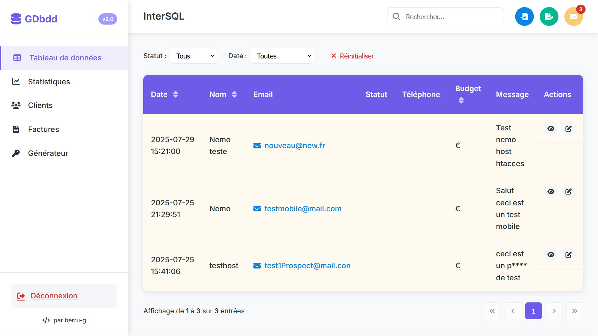

# Contacts PHP + SQL sécurisé

        - Dossier me servant de template fait pour un client ( juin 2025 )

## Formulaire de contact

        - ✅ 6 input de renseignement (mail, nom, statut, siteweb, numéro, message)
        - ✅ redirection user
        - ✅ enregistrement dans bdd SQL
        - ⚠️ Vérifier l'envoie de mail auto au client en plus de l'enregistrement dans la bdd

## Interface admin

        - ✅ Accés via mdp (hashé)
        - ✅ Récup bdd
        - ✅ Recherche par mot clef / date etc
        - ✅ Réponse par mail via lien
        - ✅ mdp hashé
        - ⚠️ mdp bdd en clair ( à finir ou config dans hébergeur)
        - ⚠️ Features (Export / import de bdd, alert de mess reçu) non fonctionnel !
        - ⚙️ Ajouter "créer une facture à partir du mail reçu".

## Facturation (personnalisable)

#### Bonne base de travail à revoir niveau sécurité (testé via SQLMap)
